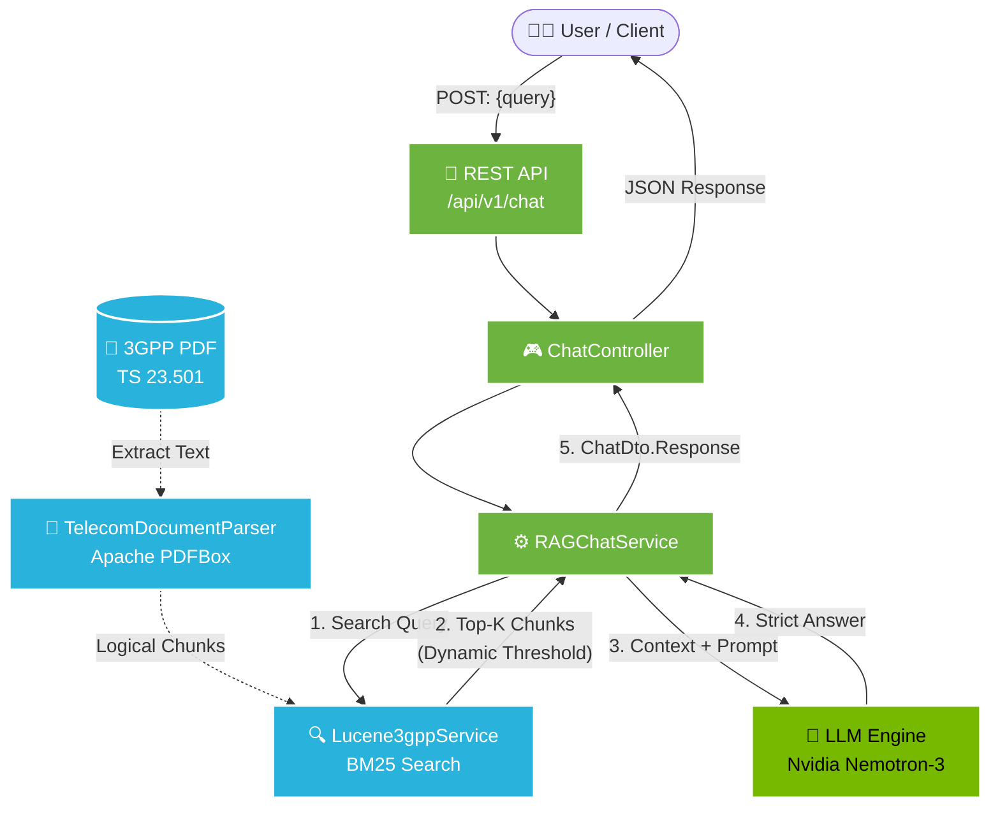

# 📡 MAVguard-RAG: Zero-Hallucination Telecom Chatbot


An enterprise-grade Retrieval-Augmented Generation (RAG) application engineered specifically to parse, index, and query **Telecom 3GPP standards documentation (TS 23.501)**. 

Built with a strict focus on **zero hallucinations**, this system utilizes a custom Apache Lucene BM25 indexing pipeline, dynamic scoring threshold guardrails, and deterministic LLM prompting to ensure outputs are strictly bound to 3GPP context.

### 🌐 Live Interactive Demo
**Access the live deployment here:** [https://mavguard-rag.onrender.com](https://mavguard-rag.onrender.com)  
*(Note: As this is hosted on a free cloud tier, the initial startup may take 30-50 seconds if the container is asleep).*

---

## 🏗️ System Architecture

The application is built on a scalable Spring Boot backend, utilizing in-memory Lucene indexing for ultra-fast document retrieval and the OpenAI SDK for LLM orchestration.



---

## 🔄 The Zero-Hallucination RAG Pipeline

To meet strict telecom engineering requirements, this pipeline refuses to answer if relevant context is not found in the official standards.

```mermaid
sequenceDiagram
    participant U as User
    participant C as Controller
    participant S as RAGChatService
    participant L as Lucene Index
    participant AI as Nvidia LLM

    U->>C: POST /api/v1/chat {"query": "..."}
    C->>S: askQuestion(query)
    
    rect rgb(40, 40, 50)
    Note over S,L: 1. Retrieval Phase
    S->>L: search(query, topK=10)
    L-->>S: Return ScoreDocs
    end

    alt Highest Score < 1.5 (Threshold)
        S-->>C: Return "Information not found..."
        C-->>U: 200 OK (Fallback Response)
    else Context Found
        rect rgb(30, 60, 40)
        Note over S,AI: 2. Augmentation & Generation Phase
        S->>S: Assemble Prompt with Source & Clauses
        S->>AI: Send System Prompt + Context (Temp = 0.0)
        AI-->>S: Grounded Technical Answer
        S-->>C: Return Answer + Context Sources
        C-->>U: 200 OK (JSON with Sources)
        end
    end

```



---

## ✨ Key Technical Features

### 1. Advanced 3GPP Parsing Strategy

* Uses `PDFTextStripper` to dynamically skip table of contents (first 15 pages).
* Implements precise Regex `(?m)^(\\d+(\\.\\d+)+)\\s+([^\\n]+)` to logically chunk documents exactly by **3GPP Clause/Section Numbers** rather than arbitrary token counts, ensuring semantic integrity.

### 2. Custom Lucene Indexing & Dynamic Thresholding

* Eliminates dependence on expensive external vector databases by utilizing **Apache Lucene 10.5.0** (ByteBuffersDirectory) for high-speed BM25 keyword/semantic hybrid retrieval.
* Implements a **Dynamic Score Threshold Multiplier (0.75x)** based on the top document score to filter out irrelevant long-tail results.
* Enforces a Hard Maximum `RELEVANCE_THRESHOLD` (1.5f). If the top result doesn't meet this, the system short-circuits and refuses to hallucinate.

### 3. Deterministic LLM Execution

* Model: `nvidia/nemotron-3-ultra-550b-a55b:free`
* Temperature: `0.0` for maximum deterministic output.
* Strict System Prompting forcing the LLM to output specific citation formats: `[Source: {Document ID}, Clause {Section Number}]`.

---

## 🛠️ Tech Stack

* **Core:** Java 21, Spring Boot 4.x
* **Search & Indexing:** Apache Lucene 10.5.0
* **Document Processing:** Apache PDFBox 2.0.30
* **AI Integration:** OpenAI Java SDK (Targeting OpenAI-compatible endpoints)
* **API Specs:** SpringDoc OpenAPI 3.0.2 (Swagger)
* **Deployment:** Docker, multi-stage Alpine images

---

## 🛜 API Documentation

### Endpoint: Chat Query

`POST /api/v1/chat`

**Request Body:**

```json
{
  "query": "What are the core network functions of a 5G system?"
}

```

**Response (Success):**

```json
{
  "response": "The core network functions include AMF, SMF, and UPF... [Source: TS_23501, Clause 5.1.1]",
  "actuallyFound": true,
  "sources": [
    {
      "docId": "TS_23501",
      "sectionNumber": "5.1.1",
      "score": 4.85,
      "content": "..."
    }
  ]
}

```

**Response (Context Not Found):**

```json
{
  "response": "Information not found in the provided 3GPP documentation.",
  "actuallyFound": false,
  "sources": []
}

```
## 🧪 Testing Guide

To test the hallucination guardrails on the [Live UI](https://mavguard-rag.onrender.com), try the following queries. Observe the **Source Inspector Sidebar** to see the exact Lucene chunks and scores utilized.

**1. Direct Factual Query**
> *"What are the primary responsibilities of the AMF?"*
> *(Expected: Accurate extraction of AMF features with high-confidence Lucene scores).*

**2. Relational Query**
> *"Explain how the SMF interacts with the UPF."*
> *(Expected: Coherent synthesis of multiple clauses).*

**3. The Guardrail Trap (Out-of-Domain)**
> *"How does the 5G core handle billing and payment processing for Netflix?"*
> *(Expected: The system strictly rejects the prompt and refuses to hallucinate).*

---
